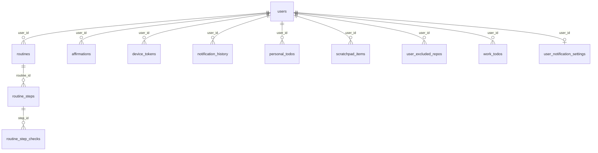

# ERD

`backend/migrations` 의 up 파일을 빈 DB 에 전부 적용한 스키마의 지도다. 규칙과 체커는 [`README.md`](README.md) 에 있다 — 표가 스키마와 어긋나면 ERD 를 고친다.

## 엔티티

### `affirmations`

의미: [`affirmations.Affirmation`](../../backend/internal/affirmations/store.go)

| 컬럼 | 타입 | NULL | 키 |
| --- | --- | --- | --- |
| `id` | INTEGER | NO | PK |
| `user_id` | INTEGER | NO | FK → users.id |
| `text` | TEXT | NO |  |
| `priority` | TEXT | NO |  |
| `created_at` | INTEGER | NO |  |
| `updated_at` | INTEGER | NO |  |

| 인덱스 | 컬럼 | UNIQUE | 조건 |
| --- | --- | --- | --- |
| `idx_affirmations_user_id` | `user_id` | NO | - |

### `device_tokens`

의미: [`devicetokens`](../../backend/internal/devicetokens/store.go)

| 컬럼 | 타입 | NULL | 키 |
| --- | --- | --- | --- |
| `id` | INTEGER | NO | PK |
| `user_id` | INTEGER | NO | FK → users.id |
| `token` | TEXT | NO |  |
| `platform` | TEXT | NO |  |
| `created_at` | INTEGER | NO |  |
| `updated_at` | INTEGER | NO |  |

| 인덱스 | 컬럼 | UNIQUE | 조건 |
| --- | --- | --- | --- |
| `UNIQUE(device_tokens.token)` | `token` | YES | - |
| `idx_device_tokens_user_id` | `user_id` | NO | - |

### `notification_history`

의미: [`notificationhistory.Item`](../../backend/internal/notificationhistory/store.go)

| 컬럼 | 타입 | NULL | 키 |
| --- | --- | --- | --- |
| `id` | INTEGER | NO | PK |
| `user_id` | INTEGER | NO | FK → users.id |
| `repo_full_name` | TEXT | NO |  |
| `pr_number` | INTEGER | YES |  |
| `pr_title` | TEXT | YES |  |
| `pr_url` | TEXT | YES |  |
| `commit_url` | TEXT | YES |  |
| `run_url` | TEXT | YES |  |
| `workflow_name` | TEXT | NO |  |
| `head_branch` | TEXT | NO |  |
| `conclusion` | TEXT | NO |  |
| `acknowledged_at` | INTEGER | YES |  |
| `created_at` | INTEGER | NO |  |
| `head_sha` | TEXT | NO |  |

| 인덱스 | 컬럼 | UNIQUE | 조건 |
| --- | --- | --- | --- |
| `idx_notif_history_user_acked` | `user_id`, `acknowledged_at` | NO | - |
| `idx_notif_history_user_created` | `user_id`, `created_at DESC` | NO | - |

### `personal_todos`

의미: [`todos.Todo`](../../backend/internal/todos/store.go)

| 컬럼 | 타입 | NULL | 키 |
| --- | --- | --- | --- |
| `id` | INTEGER | NO | PK |
| `user_id` | INTEGER | NO | FK → users.id |
| `title` | TEXT | NO |  |
| `memo` | TEXT | NO |  |
| `due_date` | TEXT | YES |  |
| `priority` | TEXT | YES |  |
| `completed_at` | INTEGER | YES |  |
| `created_at` | INTEGER | NO |  |
| `updated_at` | INTEGER | NO |  |

| 인덱스 | 컬럼 | UNIQUE | 조건 |
| --- | --- | --- | --- |
| `idx_personal_todos_user_id` | `user_id` | NO | - |

### `routine_step_checks`

의미: [`routines.DayStep`](../../backend/internal/routines/store.go)

| 컬럼 | 타입 | NULL | 키 |
| --- | --- | --- | --- |
| `step_id` | INTEGER | NO | PK, FK → routine_steps.id |
| `day` | TEXT | NO | PK |
| `checked_at` | INTEGER | NO |  |

### `routine_steps`

의미: [`routines.Step`](../../backend/internal/routines/store.go)

| 컬럼 | 타입 | NULL | 키 |
| --- | --- | --- | --- |
| `id` | INTEGER | NO | PK |
| `routine_id` | INTEGER | NO | FK → routines.id |
| `position` | INTEGER | NO |  |
| `title` | TEXT | NO |  |
| `created_at` | INTEGER | NO |  |

| 인덱스 | 컬럼 | UNIQUE | 조건 |
| --- | --- | --- | --- |
| `idx_routine_steps_routine_id` | `routine_id` | NO | - |

### `routines`

의미: [`routines.Routine`](../../backend/internal/routines/store.go)

| 컬럼 | 타입 | NULL | 키 |
| --- | --- | --- | --- |
| `id` | INTEGER | NO | PK |
| `user_id` | INTEGER | NO | FK → users.id |
| `name` | TEXT | NO |  |
| `cadence` | TEXT | NO |  |
| `weekdays` | INTEGER | NO |  |
| `month_day` | INTEGER | NO |  |
| `start_day` | TEXT | NO |  |
| `created_at` | INTEGER | NO |  |

| 인덱스 | 컬럼 | UNIQUE | 조건 |
| --- | --- | --- | --- |
| `idx_routines_user_id` | `user_id` | NO | - |

### `scratchpad_items`

의미: [`scratchpad.Item`](../../backend/internal/scratchpad/store.go)

| 컬럼 | 타입 | NULL | 키 |
| --- | --- | --- | --- |
| `id` | INTEGER | NO | PK |
| `user_id` | INTEGER | NO | FK → users.id |
| `text` | TEXT | NO |  |
| `source` | TEXT | NO |  |
| `captured_at` | INTEGER | NO |  |
| `created_at` | INTEGER | NO |  |

| 인덱스 | 컬럼 | UNIQUE | 조건 |
| --- | --- | --- | --- |
| `idx_scratchpad_items_user_id` | `user_id` | NO | - |

### `user_excluded_repos`

의미: [`excludedrepos.ExcludedRepo`](../../backend/internal/excludedrepos/store.go)

| 컬럼 | 타입 | NULL | 키 |
| --- | --- | --- | --- |
| `id` | INTEGER | NO | PK |
| `user_id` | INTEGER | NO | FK → users.id |
| `repo_full_name` | TEXT | NO |  |
| `created_at` | INTEGER | NO |  |

| 인덱스 | 컬럼 | UNIQUE | 조건 |
| --- | --- | --- | --- |
| `UNIQUE(user_excluded_repos.user_id,user_excluded_repos.repo_full_name)` | `user_id`, `repo_full_name` | YES | - |
| `idx_user_excluded_repos_repo` | `repo_full_name` | NO | - |

### `user_notification_settings`

의미: [`notificationsettings.Settings`](../../backend/internal/notificationsettings/store.go)

| 컬럼 | 타입 | NULL | 키 |
| --- | --- | --- | --- |
| `user_id` | INTEGER | NO | PK, FK → users.id |
| `enabled` | INTEGER | NO |  |
| `outcomes` | TEXT | NO |  |
| `updated_at` | INTEGER | NO |  |

### `users`

의미: [`auth.User`](../../backend/internal/auth/middleware.go)

| 컬럼 | 타입 | NULL | 키 |
| --- | --- | --- | --- |
| `id` | INTEGER | NO | PK |
| `oidc_sub` | TEXT | NO |  |
| `created_at` | INTEGER | NO |  |

| 인덱스 | 컬럼 | UNIQUE | 조건 |
| --- | --- | --- | --- |
| `UNIQUE(users.oidc_sub)` | `oidc_sub` | YES | - |
| `idx_users_oidc_sub` | `oidc_sub` | NO | - |

### `work_todos`

의미: [`todos.Todo`](../../backend/internal/todos/store.go)

| 컬럼 | 타입 | NULL | 키 |
| --- | --- | --- | --- |
| `id` | INTEGER | NO | PK |
| `user_id` | INTEGER | NO | FK → users.id |
| `title` | TEXT | NO |  |
| `memo` | TEXT | NO |  |
| `due_date` | TEXT | YES |  |
| `priority` | TEXT | YES |  |
| `completed_at` | INTEGER | YES |  |
| `created_at` | INTEGER | NO |  |
| `updated_at` | INTEGER | NO |  |

| 인덱스 | 컬럼 | UNIQUE | 조건 |
| --- | --- | --- | --- |
| `idx_work_todos_user_id` | `user_id` | NO | - |
